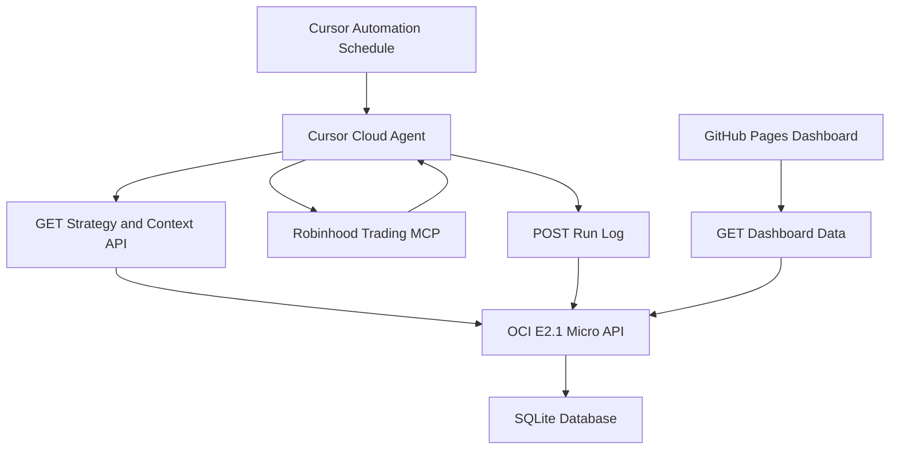

# MTA-Lab Implementation Plan

See the full feature roadmap in `.local/feature-roadmap.md` (local only, not in git).

## Target Architecture

## Core Decisions

- **Cursor Automations** on a cron schedule (cloud, no laptop required)
- **Composer 2.5** default model (Auto + Composer usage pool)
- **Robinhood Trading MCP** — `https://agent.robinhood.com/mcp/trading`
- **OCI E2.1 Micro** — FastAPI + SQLite API
- **GitHub Pages** — static dashboard
- **Research mode first** — no `place_equity_order` until flags allow

## Phases

1. API + SQLite schema and endpoints
2. Research-mode Cursor Automation
3. GitHub Pages dashboard
4. Safety gates + live trading readiness
5. Cursor usage/cost tracking
6. Optional event-driven watcher on OCI

## API Endpoints (initial)

- `GET /api/automation/context`
- `POST /api/automation/runs`
- `GET /api/dashboard/runs`
- `GET /api/dashboard/decisions`
- `GET /api/dashboard/stats`
- `GET /health`

## Safety flags (strategy object)

- `mode`: research | paper | live
- `trading_enabled`: boolean
- `allowed_symbols`, `max_order_usd`, `max_daily_trades`, `kill_switch`

## Defaults

- API: FastAPI + SQLite
- Initial mode: research
- Initial schedule: one weekday run per day
