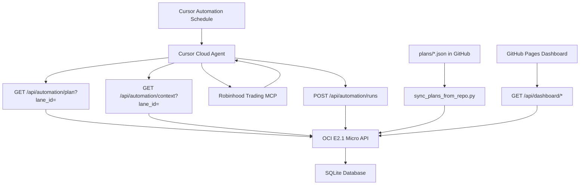

# MTA-Lab Implementation Plan

Design reference for the Market Test Agent Lab. For operational docs see the [root README](../README.md).

## Target Architecture

## Core Decisions

- **Cursor Automations** on a cron schedule (cloud, no laptop required)
- **Composer 2.5** default model (Auto + Composer usage pool)
- **Robinhood Trading MCP** — `https://agent.robinhood.com/mcp/trading`
- **OCI E2.1 Micro** — FastAPI + SQLite API
- **GitHub Pages** — static dashboard (pastel green UI)
- **Agent plans in git** — `plans/*.json` synced to API; dashboard read-only viewer
- **Multi-lane simulation** — one paper track per plan; one live lane at a time
- **Research mode first** — no `place_equity_order` until flags allow

## Implementation status

| Phase | Status | Notes |
|-------|--------|-------|
| API + SQLite schema | Done | Migrations, retention, rollups |
| Agent plans | Done | Repo sync, version history, per-lane binding |
| Multi-lane simulation | Done | Lanes, compare, live periods, sequential mode |
| Research automation | Done | [research-prompt.md](automation/research-prompt.md) |
| Dashboard | Done | Lanes, live track, plans viewer, safety controls |
| Safety + live promotion | Done | Preflight, promotion tokens, kill switch |
| Cost tracking | Done | Usage import, budgets, cost dashboard |
| Event-driven watcher | Done | `scripts/price_watcher.py` on OCI cron |

## Key API surfaces

**Automation**

- `GET /api/automation/plan?lane_id=`
- `GET /api/automation/context?lane_id=`
- `POST /api/automation/runs`

**Dashboard**

- `GET /api/dashboard/stats`, `/runs`, `/decisions`, `/portfolio?lane_id=`
- `GET /api/dashboard/lanes`, `/lanes/compare`, `/lanes/live-history`
- `PATCH /api/dashboard/strategy`

**Admin**

- `POST /api/admin/plans/sync-from-repo`
- `POST /api/admin/lanes`, `/lanes/{id}/promote-to-live`
- `POST /api/admin/retention/run`

## Safety flags (strategy object)

- `mode`: research | paper | live
- `trading_enabled`: boolean
- `allowed_symbols`, `max_order_usd`, `max_daily_trades`, `kill_switch`

Editable via dashboard **Safety Controls** or `PATCH /api/dashboard/strategy`.

## Defaults

- API: FastAPI + SQLite
- Initial mode: research
- Initial schedule: one weekday run per day
- OCI: `MTA_SEQUENTIAL_LANES=true` for shared micro VM

## Documentation map

| Doc | Topic |
|-----|--------|
| [agent-plans.md](agent-plans.md) | Plan JSON and GitHub sync |
| [automation/multi-lane-simulation.md](automation/multi-lane-simulation.md) | Lanes and live track |
| [dashboard/README.md](../dashboard/README.md) | Frontend setup |
| [ops-oci.md](ops-oci.md) | Production deployment |
| [safety-gates.md](safety-gates.md) | Live trading gates |
