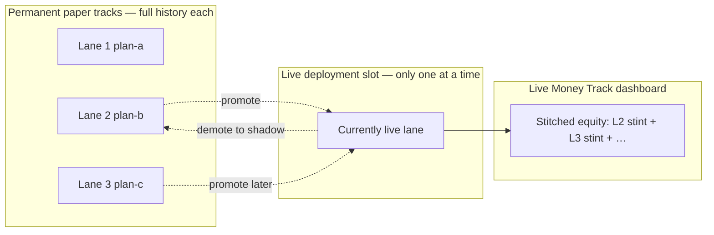

# Multi-Lane Simulation

Run multiple strategy/plan approaches against each other. Each lane is a **permanent simulation track** with its own full history. Only one lane is **live** at a time (real money); promoting a challenger moves live deployment without erasing anyone's past.

## Three plans — concrete example

Say you want to compare **plan A**, **plan B**, and **plan C** and later switch which one trades live:

| Lane | Name | Bound plan | Role while researching | What you get |
|------|------|------------|------------------------|--------------|
| 1 | `plan-a` | plan v1 + strategy v2 | `research` | Full paper history: runs, decisions, equity curve, memory |
| 2 | `plan-b` | plan v2 + strategy v2 | `research` | Same — completely separate portfolio |
| 3 | `plan-c` | plan v3 + strategy v3 | `research` | Same |

Each lane keeps its **own** cash, positions, snapshots, and symbol memory forever (subject to [retention](../ops-oci.md)). Lane 1's week-3 equity curve is still there after you promote lane 2 to live.

### After you promote plan B to live

```text
Lane 1 (plan-a)  →  shadow   — still has full paper history; keeps simulating
Lane 2 (plan-b)  →  live     — real Robinhood orders + paper mirror on this lane
Lane 3 (plan-c)  →  research — still has full paper history; keeps simulating
```

Later you promote plan C:

```text
Lane 2 (plan-b)  →  shadow   — full history preserved (including when it was live)
Lane 3 (plan-c)  →  live     — real orders now follow plan C
```

Nothing is deleted on promotion. Old live lanes become **shadow** challengers with their complete run log intact.

### Two different “histories” (both visible in the dashboard)

| View | What it shows |
|------|----------------|
| **Per-lane portfolio / compare / paper equity chart** | Each plan's simulation from day one — select lane 1, 2, or 3 in the dashboard |
| **Live Money Track** | One stitched timeline of **real-money deployment**: lane 2's snapshots while it was live, then lane 3's after handoff |

The Live Money Track is not a fourth lane — it combines snapshots from whichever lane held `lane_role=live` during each period (`lane_live_periods` in the DB).



### Setup checklist for 3 plans

1. Add three plan files in [`plans/`](../../plans/) (`v1.json`, `v2.json`, `v3.json`) and sync:
   ```bash
   python3 api/scripts/sync_plans_from_repo.py
   ```
   See [agent-plans.md](../agent-plans.md).
2. Create three lanes via `POST /api/admin/lanes`, each with a distinct `plan_version` (and matching `strategy_version`).
3. Run automations with `lane_id=1`, `2`, `3` (sequential mode on OCI — one lane per cycle).
4. Compare via **Lane Comparison**, **Paper Portfolio Comparison**, and **Agent Plans** in the dashboard.
5. Promote the winner: `POST /api/admin/lanes/{id}/promote-to-live`.
6. Keep all three automations running — shadows continue paper sims; only the live lane places real orders.

## Concepts

| Term | Meaning |
|------|---------|
| **Lane** | A permanent simulation track bound to one `strategy_version` + one `plan_version`; owns its own runs, portfolio, snapshots, and memory |
| **Primary lane** | Default lane (`id=1`, name `primary`) — used when `lane_id` is omitted |
| **Research** | Paper-only lane for experiments |
| **Shadow** | Paper lane running alongside live — often a former live lane; **history is never cleared on demotion** |
| **Live** | The one lane that may submit real `buy`/`sell` orders — a **role** assigned to a lane, not a separate database object |
| **Live Money Track** | Dashboard view stitching equity from each lane's live stint(s), in order |

Each lane is bound to a **strategy version + plan version** pair at creation time. Automations pass `lane_id` on context, plan, memory, and runs.

## Sequential vs parallel execution

On a small VM (e.g. OCI E2.1.Micro with ~1 GiB RAM), run lanes **one at a time** instead of N parallel Cursor automations:

```bash
# In api/.env on OCI
MTA_SEQUENTIAL_LANES=true
MTA_LANE_LOCK_TTL_MINUTES=45
```

With sequential mode enabled:

1. Keep **one automation** (or N automations on the same cron — only one proceeds).
2. `GET /api/automation/context?lane_id=N` returns `lane_turn`:
   - `granted: true` → this lane may run; lock acquired until `POST /runs` completes.
   - `granted: false` → **exit immediately** (same as `check_needed: false`).
3. Lanes rotate by **oldest last run** — fairest round-robin across active lanes.
4. If an automation crashes, the lock expires after `MTA_LANE_LOCK_TTL_MINUTES` (default 45).

Optional: `GET /api/automation/lanes/turn?lane_id=N` — same turn check without full context.

**Parallel mode** (`MTA_SEQUENTIAL_LANES=false`): separate automations may run simultaneously (more RAM/CPU on the API host).

## API workflow

### 1. Create lanes (admin)

```bash
curl -X POST "$API/api/admin/lanes" \
  -H "X-API-Key: $WRITE_KEY" \
  -H "Content-Type: application/json" \
  -d '{
    "name": "conservative-v2",
    "strategy_version": "v2",
    "plan_version": "v1",
    "lane_role": "shadow"
  }'
```

### 2. Agent run (per automation)

```text
GET /api/automation/context?lane_id=2
GET /api/automation/plan?lane_id=2
GET /api/automation/symbols/{symbol}/memory?lane_id=2
POST /api/automation/runs  { "lane_id": 2, ... }
```

`lane_id` defaults to the primary lane when omitted.

### 3. Compare lanes

```bash
curl "$API/api/dashboard/lanes/compare?lane_ids=1,2,3"
```

Per-lane metrics include **lane-scoped** `equity_change_usd` from snapshots (not the global curve).

### 4. Promote challenger to live

Requires preflight pass:

```bash
curl -X POST "$API/api/admin/lanes/2/promote-to-live" \
  -H "X-API-Key: $WRITE_KEY"
```

Demotes the current live lane to `shadow`, sets the target to `live`, and activates live trading with the promoted lane's strategy rules.

## Cursor Automation setup

### Sequential (recommended on OCI E2.1.Micro)

Set `MTA_SEQUENTIAL_LANES=true` on the API. Use **one cron**; you may keep separate automations per lane — each calls context first and skips when `lane_turn.granted` is false:

| Automation | Env / prompt | Lane |
|------------|--------------|------|
| Lane runner (primary) | `MTA_LANE_ID=1` | primary |
| Lane runner (challenger A) | `MTA_LANE_ID=2` | shadow |
| Lane runner (challenger B) | `MTA_LANE_ID=3` | shadow |

All can share the same schedule; the API ensures only one lane executes per cycle.

### Parallel (more resources required)

Set `MTA_SEQUENTIAL_LANES=false`. Run **N automations** on the same schedule, each with a different lane:

| Automation | Env / prompt | Lane |
|------------|--------------|------|
| Research baseline | `MTA_LANE_ID=1` | primary |
| Challenger A | `MTA_LANE_ID=2` | shadow |
| Challenger B | `MTA_LANE_ID=3` | shadow |

Document `lane_id` in each automation's prompt and pass it on every context fetch and run POST.

**During live deployment:** keep one automation on the live lane; run shadow automations in parallel with the same market-input steps but never submit live orders unless `lane_role=live`.

## Dashboard

- **Live Money Track** — stitched equity across every lane that has been live; timeline of live stints; former live lanes keep full history when demoted to shadow
- **Simulation Lanes** — card view with role badges (live / shadow / research); links to portfolio and plan viewer
- **Agent Plans** — read-only per-lane plan viewer; **Edit on GitHub** when `PLANS_REPO_URL` is set in dashboard config
- **Lane Comparison** — head-to-head per-lane metrics (correct equity per lane)
- **Paper Portfolio Comparison** — overlay equity curves for challengers
- **Portfolio selector** — view any lane's cash/positions and snapshots
- **Safety Controls** — mode, kill switch, caps (creates new strategy version on save)

`GET /api/dashboard/lanes/live-history` returns combined live stint history for dashboards and reporting.

See [dashboard/README.md](../../dashboard/README.md).

## Storage notes

- Each lane has isolated `simulated_cash`, `simulated_positions`, `portfolio_snapshots`, and `symbol_memory_summaries`
- Cooldowns and daily trade caps are **per lane**
- Quote cache and news remain global (shared market data)

## Recommended practice

1. Start with primary lane in research until you have a baseline
2. Create shadow lanes for each strategy/plan variant you want to test
3. Run lanes sequentially (OCI) or parallel automations for 1–2 weeks; compare via `/api/dashboard/lanes/compare`
4. Promote the best shadow lane to live when preflight passes
5. Keep other shadows running to monitor challengers against live performance

## Related

- [agent-plans.md](../agent-plans.md) — plan JSON in GitHub
- [dashboard/README.md](../../dashboard/README.md) — UI sections
