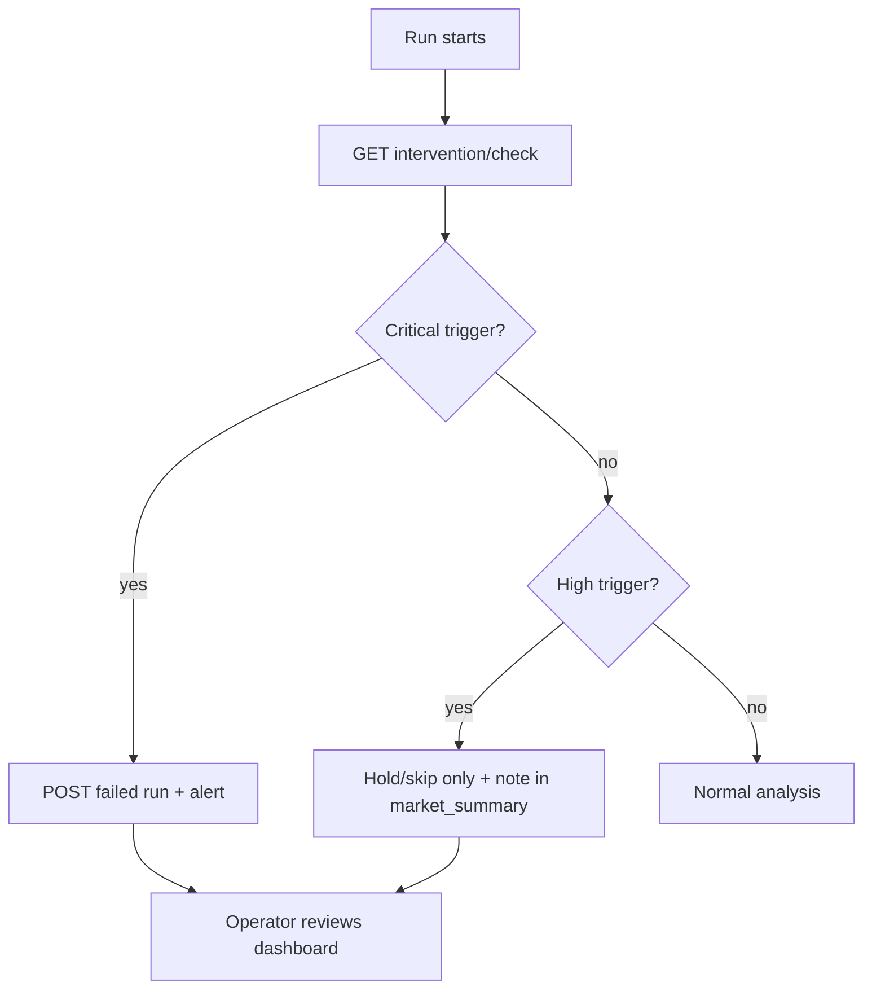

# Human Intervention Protocol

When the MTA-Lab agent should **stop**, **hold only**, or **alert an operator** — and what to do instead of trading.

## Principles

1. **Default:** research mode, simulated trades, autonomous weekday runs.
2. **Intervention is rare:** most runs complete without human action.
3. **When in doubt:** log a failed run or hold/skip; never guess through safety ambiguity.
4. **Cursor Automations cannot wait for chat:** escalation means stop + webhook/failed run + dashboard review.

## API check

Before analysis (after context load):

```http
GET /api/automation/intervention/check
```

Also available on context as `intervention_status`.

| Field | Meaning |
|-------|---------|
| `intervention_required` | true when operator review is needed before normal trading |
| `triggers[]` | Active trigger codes with severity and recommended action |
| `recommended_action` | Plain-language guidance for this run |

## Trigger catalog

| Code | Severity | Agent action |
|------|----------|--------------|
| `repeated_failed_runs` | critical | Stop; POST failed run; alert operator |
| `reconciliation_mismatch` | high | Hold/skip; note mismatch; request manual review |
| `stale_required_inputs` | high | Hold/skip; cite freshness warnings |
| `kill_switch_active` | high | Hold/skip only |
| `live_trading_enabled` | high | Manual review before any live intent |
| `live_preflight_failed` | critical | Stop; do not enable live trading |

## Escalation workflow

Review triggers in the dashboard **Strategy** card (intervention section) or **Alert Inbox**. See [dashboard/README.md](../dashboard/README.md).



## Operator actions

| Situation | Dashboard / ops |
|-----------|-----------------|
| Failed runs | Review run errors, MCP/API connectivity |
| Reconciliation mismatch | Compare Robinhood orders vs decisions; use Safety panel if needed |
| Kill switch | Use **Safety Controls** to turn off kill switch after root cause fixed |
| Live mode change | Use Safety Controls; confirm preflight at `GET /api/automation/preflight` |
| Stale data | Re-import quotes/orders; check Freshness panel |

## Automation prompt rules

- If `intervention_required` is true and severity is **critical** → failed run, no trade decisions.
- If severity is **high** → hold/skip only; explain triggers in `market_summary`.
- Auth/API/MCP failures → failed run (see research prompt).
- Mode or `trading_enabled` changes → treat as high-risk; note in run summary.

## Related

- [safety-gates.md](safety-gates.md)
- [research-prompt.md](automation/research-prompt.md)
- `POST /api/admin/alerts/reconciliation-check` — webhook alert for order/decision mismatch
